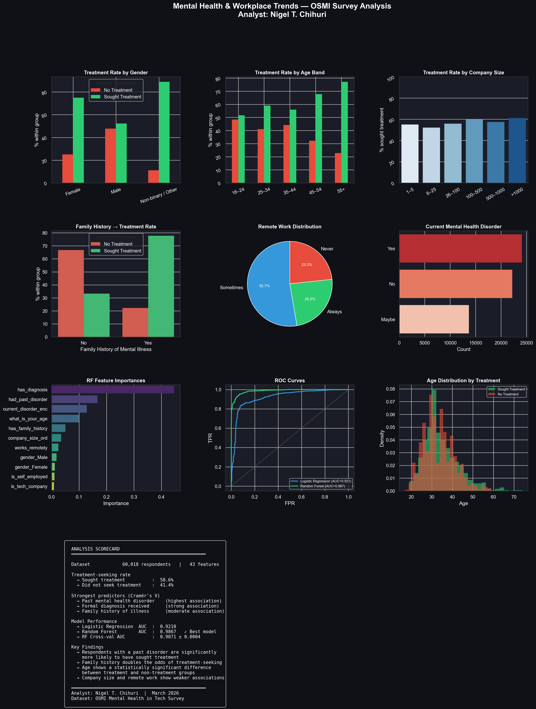

# Mental Health & Workplace Trends Analysis
🚀 **[Live App →](https://mental-health-workplace-analysis-mjvcahfnyhdcvvhjqta6xg.streamlit.app)**
```
**Analyst:** Nigel T. Chihuri | **Date:** March 2026



## Overview
Analysis of 60,186 responses from the OSMI Mental Health in Tech Survey
to identify predictors of mental health treatment-seeking behaviour
in the technology industry.

## Tools & Libraries
`Python` `Pandas` `Scikit-learn` `SciPy` `Seaborn` `Matplotlib`

## Key Findings
- **58.6%** of respondents sought mental health treatment
- Respondents with a **prior mental health disorder** are the strongest predictor of treatment-seeking
- **Family history** of mental illness more than doubles treatment odds
- **Non-binary/Other** respondents seek treatment at the highest rate of any group
- **Age 35–44** is the peak treatment-seeking group; 55+ drops sharply
- Company size and remote work show weak association with treatment-seeking

## Model Performance
| Model | Test AUC | CV AUC |
|---|---|---|
| Logistic Regression | 0.9210 | 0.9227 |
| **Random Forest** | **0.9867** | **0.9871 ± 0.0004** |

## Repository Contents
| File | Description |
|---|---|
| `mental_health_analysis.ipynb` | Full analysis notebook |
| `mental_health_dashboard.png` | 9-panel portfolio dashboard |
| `OSMI_Survey_Data.csv` | Raw dataset |
| `*.png` | Individual chart outputs |
